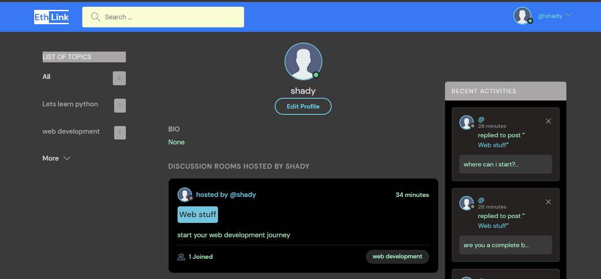

# EthLink

Basically this project provides a web based Discussion room for users. I used Pyhton-Django, Html, CSS, JavaScript for the development.

## The landing page

This is the landing page of EthLink.
from here you can

- get all the discussion rooms available
- see number all topics
- search by room and by topic name
- login and logout
  

## Create room

Create discussion room.

- The name of the room
- The topic
- And discription of the room(not required)
  

## Profile page

Profile of a user.

- Edit profile
- See rooms created by the user
- See messages user sent in a room
  
